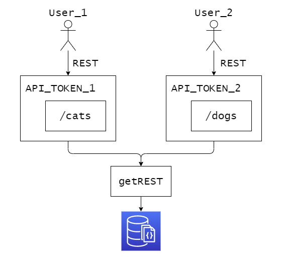

# getREST

Service to provide easy RESTful API for small business, MVP, and prototypes



# Why

Often all you need from API is just common CRUD operations, so with this tool it's easier to do so, even without programming

# Actions

`getREST` supports CRUD operations listed below:

Action  | HTTP Verb                 | Description
--------|---------------------------|--------------
Create  | `POST /<resource>`        | Create an entity represented by the JSON payload
Read    | `GET /<resource>`         | Get all entities from the resource
Read    | `GET /<resource>/<id>`    | Get a single entity by id
Update  | `PUT /<resource>/<id>`    | Replace existing entitiy with the JSON payload
Update  | `PATCH /<resource>/<id>`  | Partial update for existing entitiy with the JSON payload
Delete  | `DELETE /<resource>/<id>` | Delete an entity

# Examples

```bash
# Get personal REST endpoints
curl 'http://localhost:7777/api'
# => {'api_token': '91qe81s65196e84'}

# Get list of all cats
curl 'http://localhost:7777/api/91qe81s65196e84/cats'
# => 200 OK []

# Add new cat
curl -X POST 'http://localhost:7777/api/91qe81s65196e84/cats' \
	 -H 'Content-Type: application/json' \
	 --data '{"name": "Felix", "color": "black"}'
# => 201 OK {"_id": "1q123j9q12e3", "name": "Felix", "color": "black"}

# Get list of all cats
curl 'http://localhost:7777/api/91qe81s65196e84/cats'
# => 200 OK [{"_id": "625704ba6f047803e8ae308d", "name": "Felix", "color": "black"}]

# Get info about specific cat
curl 'http://localhost:7777/api/91qe81s65196e84/cats/625704ba6f047803e8ae308d'
# => 200 OK {"_id": "625704ba6f047803e8ae308d", "name": "Felix", "color": "black"}

# Delete specific cat
curl -X DELETE 'http://localhost:7777/api/91qe81s65196e84/cats/625704ba6f047803e8ae308d'
# => 200 OK

# Get list of all cats
curl 'http://localhost:7777/api/91qe81s65196e84/cats'
# => 200 OK []
```

# Usage

```bash
# TODO: docker run ...
```

# TODO

- [ ] Endpoint for GET
- [ ] Endpoint for POST
- [ ] Endpoint for DELETE
- [ ] Endpoint for PUT
- [ ] Endpoint for PATCH
- [ ] Dashboard for token
- [ ] Generate token API
- [ ] Token monitoring
- [ ] Token (custom) TTL
- [ ] Protected API
- [ ] Versioning?
- [ ] Nested resources?
- [ ] Field filters?
- [ ] API callbacks?
- [ ] HATEOAS?
- [ ] Idempotency?
- [ ] Custom IDs?
- [ ] Landing page?
- [ ] Docker
- [ ] Custom rate limits
- [ ] Custom caching
